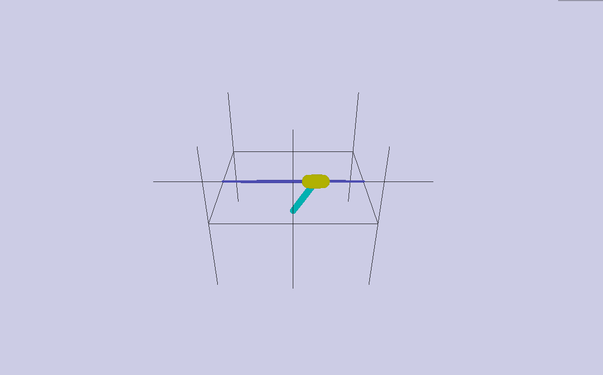

## Survey of Reinforcement Learning Techniques Using OpenAI Gym

### Motivation

In recent years, the research interest of reinforcement learning (RL) has increased significantly, partly due to the shocking breakthrough of AlphaGo by DeepMind.  The first generation of AlphaGo was able to compete and win a best-of-five series against
the best human players in 2016 – A feat previously thought impossible for at least another decade.

In late 2017, AlphaGo Zero was published.  A notable difference is that it was trained with deep RL without any kind of human guidance. Comparing the two generations of AlphaGo head-to-head, Zero dominated the previous generation 100-0 – An accomplishment that speaks to the ability of deep reinforcement learning.


### Files

* `agents.py`  - contains RL agents; each agent should define methods: `choose_action`, `learn`, `store_transition`, `save`, and `restore`
* `configs.py` - contains environment configs; sizes are number of dimenions and `action_bound` is `env.action_space.high` as outputted by gym

To start training for robo_pendulum using DDPG_TF, run

    > python main.py robo_pendulum DDPG_TF -m <output_file>

To replay a game using a trained model, run

    > python main.py <game> <agent> -m <model_file> -r


### Demo

**RoboschoolInvertedPendulumSwingup-v1**




### Setting Up Roboschool

I'm using Ubuntu 17.10 and Anaconda Python 3.6.  Instructions for setting up Roboschool can be found at https://github.com/openai/roboschool.  I've installed (using `pip`) `gym`, `agents`, `pybullet`, and `PyOpenGL` previously.  The only deviation from the Roboschool instruction is that I needed to run the Anaconda specific steps (listed under "Mac, Anaconda with Python 3") before the last step.

    > conda install qt
    > export PKG_CONFIG_PATH=$(dirname $(dirname $(which python)))/lib/pkgconfig

You may also run into the following error when running Roboschool,

    QGLShaderProgram: could not create shader program
    Could not create shader of type 2.

Adding the following line to Python script should resolve the issue.  If not, clean install Nvidia GPU driver to a newer version.

    from OpenGL import GLU


### Setting Up TensorFlow with GPU

Tensorflow's setup instruction is currently (at the time of this writing, TensorFlow v1.4.0) using an older version of CUDA and cuDNN.  By default, Ubuntu 17.10 will download CUDA 9 and cuDNN 7.

> All our prebuilt binaries have been built with CUDA 8 and cuDNN 6. We anticipate releasing TensorFlow 1.5 with CUDA 9 and cuDNN 7.

In order to use these specific versions, I needed to compile Tensorflow from source, the instructions can be found at https://www.tensorflow.org/install/install_sources.  Make sure to install all the dependencies first, then compiling from source should be straight-forward.


### Soft Replacement

Linear interpolation between target and eval.  Serves the same function as updating actor and critic (?)


```python
self.soft_replace = [[tf.assign(ta, (1-DDPG_TAU)*ta + DDPG_TAU*ea), 
    tf.assign(tc, (1-DDPG_TAU)*tc + DDPG_TAU*ec)] 
    for ta, ea, tc, ec in zip(self.at_params, self.ae_params, self.ct_params, self.ce_params)]
```


### Batch Size and Memory

Some environments finish relatively quickly, extending the duration of each episode doesn't really help.  Therefore, having a bigger memory and batch is not necessarily helpful.  For offline methods, perhaps it's desirable to start training with shorter duration in each episode and gradually increasing the length.
